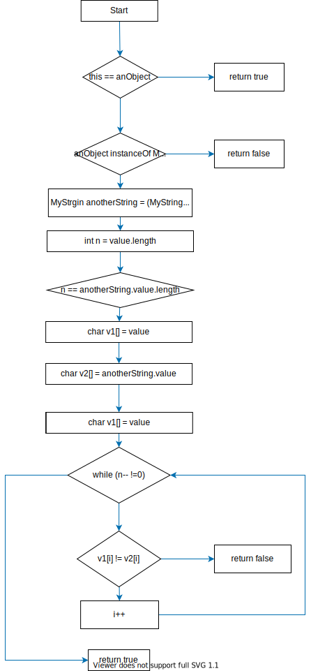
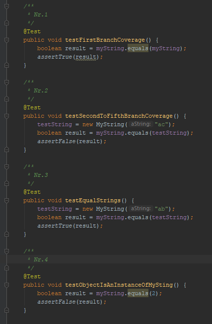
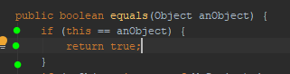
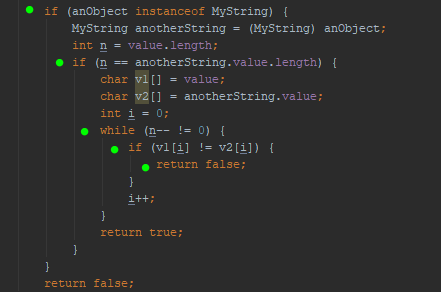
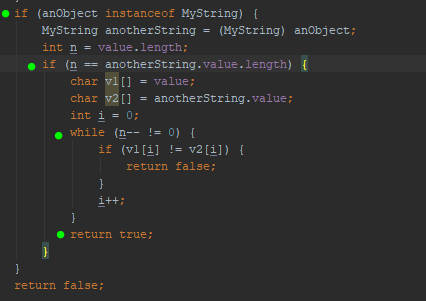
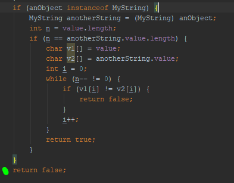
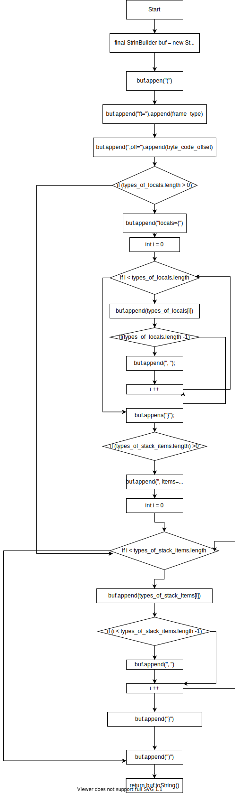

## Aufgabenblatt 4

### Aufgabe 1

Mögliche Fehlerquellen:

- Serviceaufruf am falschen Baustein
- Falscher Service oder falsche Serviceversion aufgerufen
- Falsche Interpretation der Eingabe- oder Ausgabewerte
- Falsche Reihenfolge der Eingabeparameter
- Unerlaubtes Modifizieren von Eingabeparametern
- Deadlocks
- Race Condition
- Falsche Reihenfolge der Aufrufe
- Falsche Antwortzeit
- Kein Antwort bei synchronen Aufruf

Beispielszenarien:

- Falscher Service oder falsche Serviceversion aufgerufen:

  Möglich wäre eine Änderung oder Erweiterung der Rest-Schnittstelle. Evtl wurde die Software auf den Automaten noch nicht angepasst. Somit schicken diese ihre Daten immernoch an die alte Schnittstelle. Werte können somit nicht verarbeitet / übertragen werden.

- Serviceaufruf am falschen Baustein:

  Eventuell wurde die Schnittstelle in einem falschen Baustein implementiert. Daten werden somit an die falsche Stelle geschickt.

- Unerlaubtes Modifizieren von Eingabeparametern

  Schnittstelle wurde eventuell falsch implementiert. Werte die übermittelt werden könnten dadurch fälschlicherweise manipuliert werden. 
  Daten können somit nicht mehr richtig interpretier bzw. weiterverarbeitet werden.

### Aufgabe 2

a.)

b.)
MyString | anObject | Ergebnis |
| ------------- |:-------------:| -----:|
| a = new MyString("a") | a = new MyString("a") => Es muss das gleiche Objekt übergeben werden | true (Erster Zweig abgedeckt)|
| "ab" | **"ab"** => Muss vom Typ My String sein, gleiche Länge haben, gleiche Buchstaben | true |
| "ab" | **"ac"** => Muss vom Typ My String sein, gleiche Länge haben diesmal jedoch unterschiedliche Buchstaben | false |
| "ab" | **2** => nicht vom Typ MyString sein| false |

c.)

- Test Nr.1 deckt folgende Zweige ab (grün markiert):

- Test Nr.2 deckt folgende Zweige ab (grün markiert):

- Test Nr.3 deckt folgende Zweige ab (grün markiert):

- Test Nr.4 deckt folgende Zweige ab (grün markiert):

### Aufgabe 3

a)

b)

| frame_type | code_offset | types_of_locals | types_of_stack_items |                                   Ergebnis |
| ---------- | :---------: | --------------: | -------------------: | -----------------------------------------: |
| 0          |      1      |           ["a"] |           ["c", "d"] | (ft =0, off = 1, locals={a}, items={c, d}) |

- Deckt alle Pfade ab
